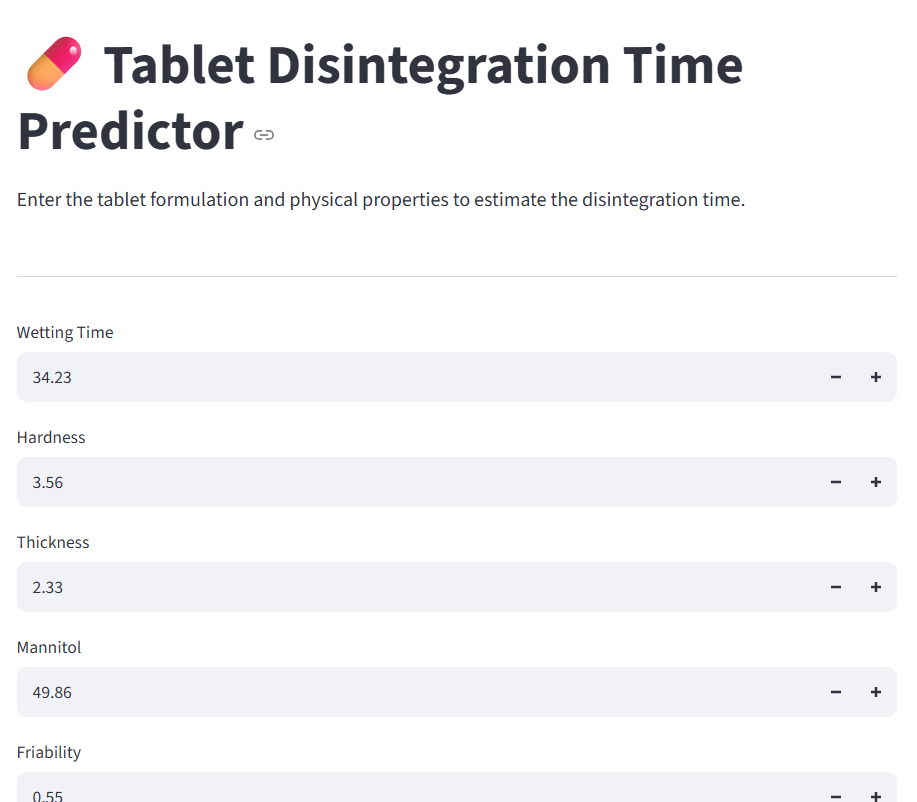

# Pharmaceutical Tablet Dissolution Prediction

## Project Overview

This project uses machine learning to predict pharmaceutical tablet dissolution/disintegration performance based on formulation and excipient-related data.

The project covers data analysis, feature selection, regression model comparison, model evaluation, and deployment of a prediction application using Streamlit.

## Objective

The main objective is to develop a machine learning model that can predict tablet performance from selected formulation-related features and compare different regression approaches.

## Technologies Used

- Python
- Pandas
- NumPy
- Scikit-learn
- Matplotlib
- Jupyter Notebook
- Joblib
- Streamlit

## Dataset

The project uses pharmaceutical formulation and excipient data containing formulation-related variables and tablet performance measurements.

The cleaned dataset is available in:

`final Data All Exipients.csv`

## Machine Learning Workflow

1. Data loading
2. Data cleaning and preprocessing
3. Exploratory data analysis
4. Feature selection
5. Train-test split
6. Regression model training
7. Model comparison
8. Model evaluation
9. Final model selection
10. Prediction application development

## Model Evaluation

The repository contains model comparison and evaluation results, including:

- `model_comparison.csv`
- `final_model_results.csv`
- `actual_vs_predicted.png`

These files provide the results of the evaluated regression models and the final model performance.

## Prediction Application

A Streamlit-based application was developed to provide predictions using the trained machine learning model.

The application code is available in:

`app.py`

The trained model and selected feature information used by the application are stored separately in the `models` section of the project.

## Application Screenshots

### Prediction Interface



### Prediction Result


## Project Structure

```text
pharmaceutical-dissolution-ml/
│
├── data/
│   └── final Data All Exipients.csv
│
├── models/
│   ├── app_features.json
│   └── final_model.pkl
│
├── results/
│   ├── actual_vs_predicted.png
│   ├── final_model_results.csv
│   └── model_comparison.csv
│
├── app.py
├── dissolution_prediction.ipynb
├── README.md
└── .gitignore
